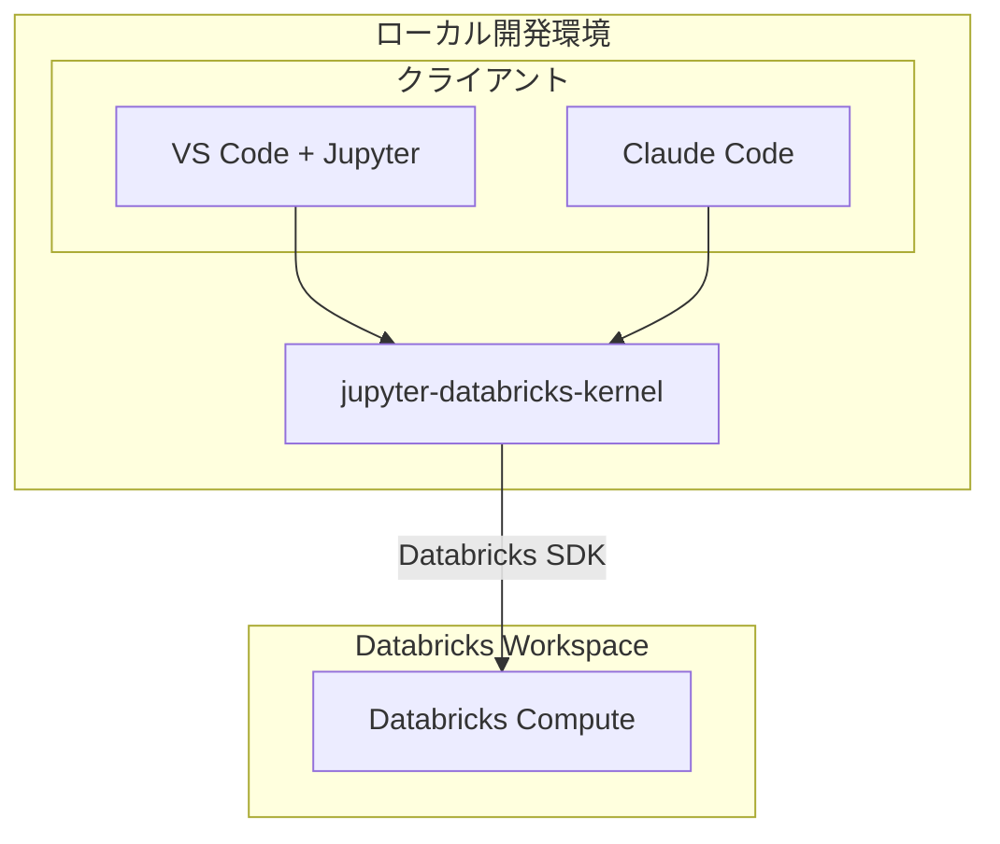
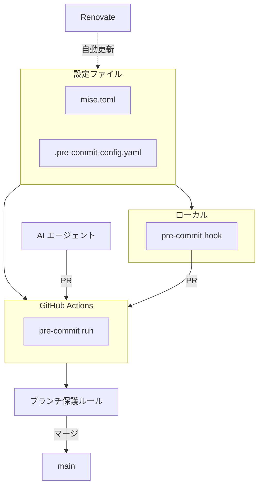

株式会社GENDA データエンジニア / MLOps エンジニアの uma-chan です。
この記事は Databricks Advent Calendar 2025 シリーズ1 Day 19 の記事です。

@[card](https://qiita.com/advent-calendar/2025/databricks)

ならびに GENDA Advent Calendar 2025 シリーズ4 Day 19 の記事です。

@[card](https://qiita.com/advent-calendar/2025/genda)

本記事は 2025-12-12 に開催された Databricks 招待イベント Data+AI World Tour Tokyo After Party での登壇内容を再構成したものです。

<!-- rumdl-disable MD057 -->
@[speakerdeck](58be33da57d84a5eb9914aa8a8c903ec)
<!-- rumdl-enable MD057 -->

## 1. はじめに

Databricks Notebook は手軽にデータ分析や機械学習のプロトタイピングができる便利なツールですが、開発体験にはいくつかの課題があります。

さらに Claude Code や Cursor などの AI コーディングアシスタントが普及した現在、これらのツールを活用しやすい状態を目指すことが重要となっています。

以下で Databricks Notebook 開発を AI-Ready にするための4つの改善策を紹介します。

## 2. 課題提起

### 2.1. 従来の Databricks Notebook 開発の課題

Databricks Notebook をそのまま使った開発には、以下のような課題があります。

1. ローカル開発環境との乖離
   - Databricks 上でしかコードを実行できない
   - 使い慣れた VS Code などのエディタが使えない
   - Git との連携が煩雑
2. コード品質管理の難しさ
   - Linter / Formatter の適用が難しい
   - テストコードの管理が複雑
   - コードレビューがしづらい
3. 依存関係管理の複雑さ
   - 依存関係を解消しバージョン固定することの難易度は想像以上に高く、突然動かなくなるリスクがある

### 2.2. AI 時代の新たな課題

Claude Code や Cursor などの AI コーディングアシスタントが登場し、開発生産性が大きく向上しましたが、Databricks Notebook 環境では AI ツールの恩恵を受けにくい状況があります。

ローカルの AI ツールから Databricks 上のコードを実行する既存の方法 (Databricks Connect、VS Code 拡張など) には、それぞれ制約があります。詳細は改善策1で説明します。

## 3. 改善策1: jupyter-databricks-kernel

### 3.1. 概要

まず紹介するのは、私が開発した `jupyter-databricks-kernel` です。

@[card](https://github.com/i9wa4/jupyter-databricks-kernel)

Jupyter におけるカーネルとは、ノートブックのセルを処理し、結果をフロントエンド (VS Code や JupyterLab など) に送信するコンポーネントです。

`jupyter-databricks-kernel` は、ローカルの Jupyter 環境から Databricks Compute (all-purpose) に接続できるカーネルを提供します。これにより、以下のようなコマンドでノートブックを実行できます。

```sh
jupyter execute notebook.ipynb --kernel_name=databricks --inplace
```

### 3.2. 既存アプローチとの違い

Databricks でのローカル開発には、公式の VS Code 拡張 (Databricks Connect Integration) というアプローチがあります。

[公式ドキュメント](https://docs.databricks.com/aws/en/dev-tools/vscode-ext/notebooks) によると、VS Code 拡張のノートブック実行は Databricks Connect を使用しており、以下のように動作します。

> All code runs locally, while all code involving DataFrame operations runs on the cluster in the remote Databricks workspace and run responses are sent back to the local caller.

つまり、通常の Python コードはローカルで実行され、DataFrame 操作のみがリモートクラスタで実行されます。

| 観点                 | VS Code 拡張 (Databricks Connect)    | jupyter-databricks-kernel   |
| -------------------- | ---------------------------------    | --------------------------- |
| 実行場所             | ローカル + リモート (DataFrame のみ) | Databricks 上               |
| 実行結果の取得       | ○                                   | ○                          |
| AI ツールからの実行  | ×                                   | ○                          |
| DBR プリインストール | ローカルにも要インストール           | そのまま利用可能            |

`jupyter-databricks-kernel` はすべてのコードを Databricks 上で実行するため、Databricks Runtime にプリインストールされたライブラリをそのまま利用でき、任意のエディタや AI ツールから実行結果を取得できます。

### 3.3. メリット

- 既存のローカル開発環境のフル活用
    - VS Code + Jupyter 拡張で快適な開発体験
    - 使い慣れたエディタの機能をフル活用
- AI ツールとの連携が容易
    - `jupyter execute` コマンドでノートブックを実行し、結果を取得できる
    - AI が実行結果を見て次のアクションを判断できるため、自律的な試行錯誤が可能
    - ローカル環境から独立しているため、大規模 DataFrame の処理などクラスタのリソースを気兼ねなく利用できる

### 3.4. デメリット

- 利用している API の制約上 Serverless Compute には対応していない

### 3.5. アーキテクチャ



## 4. 改善策2: Skinny Notebook Wrapper + Pure Python

### 4.1. 基本的な考え方

ノートブックは便利ですが、ロジックをすべてノートブックに書くと管理が難しくなります。そこで推奨するのが "Skinny Notebook Wrapper + Pure Python" (いずれも造語) パターンです。

Web 開発における "Skinny Controller, Fat Model" (コントローラーは処理を振り分けるだけで、ビジネスロジックはモデル層に書く設計) と同じ考え方です。

- ノートブックは「薄いラッパー」として使い続ける
- メインロジックは `.py` ファイルに切り出す
- ノートブックからは `.py` ファイルを呼び出すだけ

### 4.2. なぜノートブックを残すのか

ロジックを `.py` に切り出しても、ノートブックは以下の理由で便利です。

| 役割                                 | ノートブック  | .py ファイル  |
| ------                               | ------------- | ------------- |
| マジックコマンド (%pip install 等)   | ○            | ×            |
| dbutils.widgets によるパラメータ定義 | ○            | ×            |
| テストの書きやすさ                   | ×            | ○            |
| AI ツールとの親和性                  | △            | ○            |

つまり、ノートブックは「Job のエントリーポイント」として残しつつ、ロジックは `.py` に書くのがベストです。

### 4.3. 構成例

```text
project/
├── launcher.py       # 薄いラッパー(Source形式ノートブック)
├── main.py           # メインロジック(通常の Python ファイル)
├── test_main.py      # テストコード
└── pyproject.toml    # uv, Ruff 設定等
```

ここまで整理すると非常にすっきりしますが、雑に .py に切り出して雑に呼び出すだけでも大きく効果を得られます。

### 4.4. launcher (ノートブック) の例

<!-- rumdl-disable MD036 -->
**Cell 1: Widget 定義**
<!-- rumdl-enable MD036 -->

`dbutils.widgets.text()` でパラメータとデフォルト値を定義します。

```python
dbutils.widgets.text("table_name", "samples.nyctaxi.trips", "Table Name")
dbutils.widgets.text("limit", "10", "Limit")
```

<!-- rumdl-disable MD036 -->
**Cell 2: main() 実行**
<!-- rumdl-enable MD036 -->

Widget で定義したパラメータを取得し、ロジック(`main.py`)に渡します。

```python
from main import main

main(
    table_name=dbutils.widgets.get("table_name"),
    limit=int(dbutils.widgets.get("limit")),
)
```

ポイント

- ノートブックは「起動装置」に徹する
- `dbutils` は Databricks Compute では事前定義されているので Notebook 内で使い切っておく
    - .py ファイルに `dbutils` を書かないことで未定義エラーを効かせることができる

### 4.5. main.py にロジックを集約

```python
"""メインロジックモジュール"""

from pyspark.sql import DataFrame, SparkSession


def load_table(spark: SparkSession, table_name: str, limit: int) -> DataFrame:
    """テーブルからデータを読み込む"""
    return spark.table(table_name).limit(limit)


def main(table_name: str, limit: int = 10) -> None:
    """メイン処理(ノートブックから呼ばれる)"""
    spark = SparkSession.builder.getOrCreate()
    df = load_table(spark, table_name, limit)
    df.show()
```

ポイント

- `load_table()` は `spark` を引数で受け取るためモック可能
- `dbutils` に依存しない
- 型アノテーション付きで IDE 補完が効く

### 4.6. テストの例

`load_table()` は `spark` を引数で受け取るため、モックを使ってテストできます。

```python
# test_main.py
from unittest.mock import MagicMock

from main import load_table


def test_load_table():
    mock_spark = MagicMock()
    mock_df = MagicMock()
    mock_spark.table.return_value.limit.return_value = mock_df

    result = load_table(mock_spark, "test_table", 10)

    mock_spark.table.assert_called_once_with("test_table")
    mock_spark.table.return_value.limit.assert_called_once_with(10)
    assert result == mock_df
```

このテストは Databricks 環境がなくても実行できます。

```bash
pytest test_main.py
```

### 4.7. メリット

1. コード品質の向上
   - Pure Python ファイルには Linter / Formatter が適用しやすい
   - 静的解析ツール(mypy など)も活用可能

2. テスタビリティの向上
   - pytest などの標準的なテストフレームワークが使える
   - ユニットテストが書きやすい

3. AI ツールとの親和性
   - Pure Python ファイルは AI アシスタントが理解しやすい
   - コード補完の精度が向上
   - リファクタリング提案も受けやすい

4. コードレビューの効率化
   - `.py` ファイルは差分が見やすい
   - PR でのレビューが容易

## 5. 改善策3: uv による依存関係管理

### 5.1. uv とは

uv は Rust 製の高速な Python パッケージマネージャです。

@[card](https://docs.astral.sh/uv/)

主な特徴

- pip の 10-100 倍高速
- `uv.lock` による再現可能な依存関係管理
- Python バージョン管理も可能

### 5.2. uv sync --active

`--active` オプションを使うと、Databricks の既存環境に直接インストールできます。

```python
%pip install uv
```

```python
import subprocess

result = subprocess.run(
    ["uv", "sync", "--no-dev", "--active"],
    capture_output=True,
    text=True
)
```

`--active` オプションは、新しい `.venv` を作成せず、現在アクティブな仮想環境を使用します。
Databricks ノートブック環境では既に仮想環境がアクティブになっているのでこのオプションを使うというわけです。

### 5.3. pyproject.toml の構成例

```toml:pyproject.toml
[project]
name = "databricks-project"
version = "0.1.0"
requires-python = ">=3.12"
dependencies = [
    # Project-specific (not included in DBR)
    "httpx",
]

[project.optional-dependencies]
dbr-17-3 = [
    # DBR 17.3 LTS preinstalled packages
    # https://docs.databricks.com/aws/en/release-notes/runtime/17.3lts
    #
    # Purpose:
    # - Used for dependency resolution in uv.lock (not installed by uv sync)
    # - Ensures compatibility with Databricks Runtime environment
    # - Excluded from Renovate updates via matchDepTypes in renovate.json
    "matplotlib==3.10.0",
    "mlflow-skinny==3.0.1",
    "numpy==2.1.3",
    "pandas==2.2.3",
    "pyarrow==19.0.1",
    "pyspark==4.0.0",
    "scikit-learn==1.6.1",
    "scipy==1.15.1",
]

[dependency-groups]
dev = [
    "jupyter-databricks-kernel",
    "jupyterlab",
    "pytest",
    "ruff",
]
```

ポイント

- `dependencies`: Databricks にインストールするパッケージ (Databricks Runtime にないもの)
- `[project.optional-dependencies]`: Databricks Runtime プリインストール済みパッケージ
    - `uv sync` ではインストールされない (依存解決のみに使用)
    - Databricks Runtime との互換性を確保するためにバージョンを固定
    - Databricks 側から requirements.txt が提供されてなさそうなのでリリースノートから情報を取得しました
- `dev`: ローカル開発ツール

### 5.4. Renovate で Databricks Runtime パッケージを更新対象から除外

後述する Renovate との相性を考慮しておきます。
Databricks Runtime プリインストールパッケージは Databricks Runtime のバージョンに合わせて固定する必要があるため、Renovate の自動更新から除外します。

```json:renovate.json
{
  "$schema": "https://docs.renovatebot.com/renovate-schema.json",
  "extends": ["config:recommended"],
  "packageRules": [
    {
      "matchDepTypes": ["optional-dependencies"],
      "enabled": false
    }
  ]
}
```

### 5.5. メリット

1. 高速なパッケージインストール
   - `pip` の 10-100 倍高速
2. 厳密なバージョン管理
   - `uv.lock` による完全なバージョン固定
   - 再現性の確保
3. ローカルと Databricks での統一
   - 同じ `pyproject.toml` / `uv.lock` をローカルと Databricks で使用
   - 環境差異によるバグを防止

## 6. 改善策4: ガードレール

### 6.1. なぜガードレールが必要か

AI ツールを活用する上で重要なのが「ガードレール」です。AI が生成したコードにも、人間が書いたコードと同じ品質チェックを適用することで、コード品質とセキュリティを担保します。

クラウド IDE からコミットしたり AI コーディングエージェントが直接 PR を作成するケースが増えているので対応しておくと安心です。

### 6.2. 推奨ツールスタック



1. **mise** (ランタイム管理)
   - ツールのバージョンを設定ファイルで一元管理
   - チーム全体で統一されたツールバージョン
2. **pre-commit** (コミット時チェック)
   - ローカルでも GitHub Actions でも同じチェックを実行
   - Linter / Formatter の自動実行
   - セキュリティスキャン
3. **Renovate** (依存関係の自動更新)
   - mise.toml、pre-commit、GitHub Actions で使用するアクションを継続的に更新
   - セキュリティパッチの自動適用
4. **ブランチ保護ルール** (最後の砦)
   - 直接 push や force push を防止

### 6.3. mise.toml の例

```toml:mise.toml
[tools]
uv = "0.9.15"
pre-commit = "4.5.0"
shellcheck = "0.11.0"
"aqua:rhysd/actionlint" = "1.7.9"
"aqua:gitleaks/gitleaks" = "8.30.0"
```

mise で uv 自体のバージョンを管理し、uv で Python のバージョンとライブラリを管理する組み合わせがおすすめです。

### 6.4. pre-commit 設定例

`repo: local` + `mise exec --` パターンを使うと、mise で管理されたツールを hook として使えます。

```yaml:.pre-commit-config.yaml
default_stages: [pre-commit]
repos:
  - repo: https://github.com/pre-commit/pre-commit-hooks
    rev: v6.0.0
    hooks:
      - id: check-json
      - id: check-yaml
      - id: detect-private-key
      - id: end-of-file-fixer
      - id: trailing-whitespace

  - repo: local
    hooks:
      - id: gitleaks
        name: Detect hardcoded secrets
        entry: mise exec -- gitleaks protect --verbose --redact --staged
        language: system
        pass_filenames: false

      - id: gitleaks-history
        name: Detect hardcoded secrets (history)
        entry: mise exec -- gitleaks detect --verbose --redact
        language: system
        pass_filenames: false
        stages: [manual]

      - id: ruff-check
        name: ruff check
        entry: mise exec -- uv run --no-sync ruff check --fix
        language: system
        types: [python]

      - id: ruff-format
        name: ruff format
        entry: mise exec -- uv run --no-sync ruff format
        language: system
        types: [python]
```

### 6.5. 主なチェックツールの例

<!-- rumdl-disable MD036 -->
**gitleaks**
<!-- rumdl-enable MD036 -->

コード内にハードコードされたシークレット(API キー、パスワード、トークンなど)を検出します。

防げる事故の例

- AI がサンプルコードを生成したとき、API キーっぽい文字列が含まれていた
- 環境変数をコピペしたとき、うっかり本番の認証情報が混入

<!-- rumdl-disable MD036 -->
**ruff**
<!-- rumdl-enable MD036 -->

Python コードの lint と format を高速に実行します。

<!-- rumdl-disable MD036 -->
**actionlint / zizmor / pinact**
<!-- rumdl-enable MD036 -->

GitHub Actions ワークフローのリスク軽減に役立ちます。
入れれば入れるほど安心だと思います。

### 6.6. GitHub Actions での実行

```yaml:.github/workflows/pre-commit.yaml
name: pre-commit

on:
  pull_request:
    branches:
      - main

jobs:
  pre-commit:
    runs-on: ubuntu-latest
    steps:
      - uses: actions/checkout@v4

      - name: Install mise
        uses: jdx/mise-action@v2
        with:
          install_args: --yes
          cache: true

      - name: Cache pre-commit
        uses: actions/cache@v4
        with:
          path: ~/.cache/pre-commit
          key: pre-commit-${{ hashFiles('.pre-commit-config.yaml') }}

      - name: Run pre-commit
        run: mise exec -- pre-commit run --all-files
```

実際の運用では pinact 等を使って SHA 固定することを推奨します。

### 6.7. CI でのテスト実行

pre-commit による lint に加えて、テストもガードレールとして追加できます。
別ジョブとして定義し、集約ジョブでまとめてブランチ保護ルールで必須にします。

```yaml
  test:
    runs-on: ubuntu-latest
    timeout-minutes: 10
    permissions:
      contents: read

    steps:
      - name: Checkout
        uses: actions/checkout@v4

      - name: Install mise
        uses: jdx/mise-action@v2
        with:
          install_args: --yes
          cache: true

      - name: Run tests
        run: mise exec -- uv run pytest

  # 集約ジョブ: ブランチ保護ルールではこのジョブを必須に設定
  # matrix でジョブが増減しても設定変更が不要になる
  ci:
    needs: [pre-commit, test]
    if: always()
    runs-on: ubuntu-latest
    timeout-minutes: 5
    steps:
      - name: Check results
        run: |
          if [[ "${{ contains(needs.*.result, 'failure') }}" == "true" ]]; then
            echo "One or more jobs failed"
            exit 1
          fi
          if [[ "${{ contains(needs.*.result, 'cancelled') }}" == "true" ]]; then
            echo "One or more jobs were cancelled"
            exit 1
          fi
          echo "All checks passed"
```

ポイント

- pre-commit には lint/format を入れておく
- CI でテストを実行し、PR マージ前に品質を担保
- 集約ジョブ (ci) をブランチ保護ルールで必須にすると、lint とテスト両方の成功が必須になる
- 改善策2 (Skinny Notebook Wrapper + Pure Python) でロジックを `.py` に切り出しておけばテストが書きやすい

### 6.8. メリット

1. AI 生成コードの品質担保
   - コミット前に自動チェック
   - 問題のあるコードがリポジトリに入らない
2. セキュリティリスクの軽減
   - シークレットの検出
   - 既知の脆弱性チェック
3. チーム全体での品質統一
   - 誰が書いたコードでも同じルールを適用
   - AI ツールが生成したコードも例外なし

## 7. まとめ

本記事では Databricks Notebook 開発環境を AI-Ready にするための 4 つの改善策を紹介しました。

| 改善策                                | 解決する課題                                |
| --------                              | ------------                                |
| jupyter-databricks-kernel             | ローカル開発環境との乖離、AI ツールとの連携 |
| Skinny Notebook Wrapper + Pure Python | コード品質管理、テスタビリティ              |
| uv による依存関係管理                 | 依存関係の複雑さ、再現性                    |
| ガードレール                          | AI 生成コードの品質・セキュリティ           |

AI ツールは強力ですが、それを最大限活用するためには開発環境の整備が欠かせません。
本記事で紹介した改善策を参考に、皆さんの Databricks 開発環境も AI-Ready にしていただければ幸いです。

## 8. 関連記事

各トピックの詳細は以下の記事で解説しています。

@[card](https://zenn.dev/genda_jp/articles/2025-12-10-organize-databricks-notebook-management)

@[card](https://zenn.dev/genda_jp/articles/2025-12-11-use-uv-in-databricks)

@[card](https://zenn.dev/genda_jp/articles/2025-12-06-ai-guardrails-local-cloud)

## 9. 参考リンク

- [jupyter-databricks-kernel (GitHub)](https://github.com/i9wa4/jupyter-databricks-kernel)
- [uv Documentation](https://docs.astral.sh/uv/)
- [mise Documentation](https://mise.jdx.dev/)
- [pre-commit Documentation](https://pre-commit.com/)
